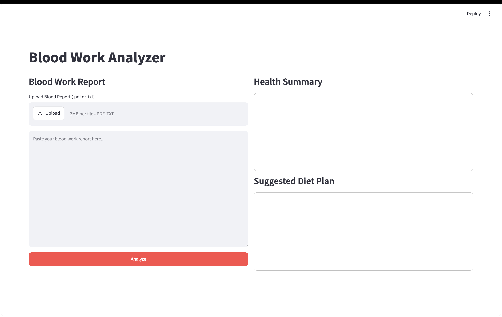
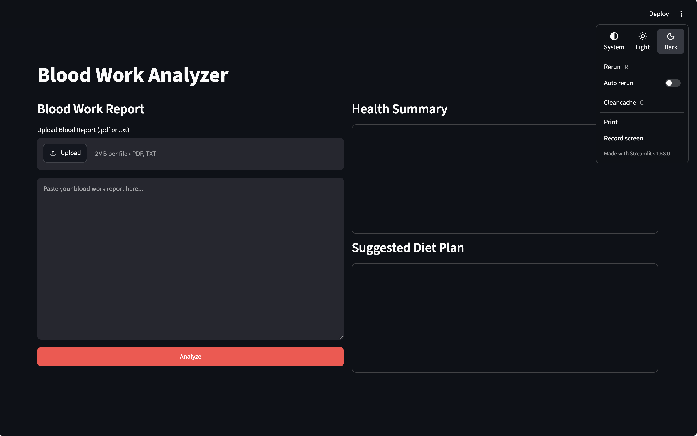
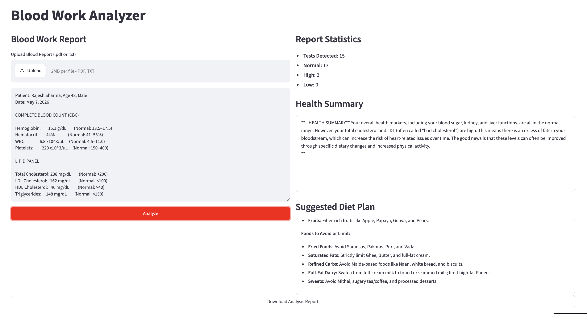
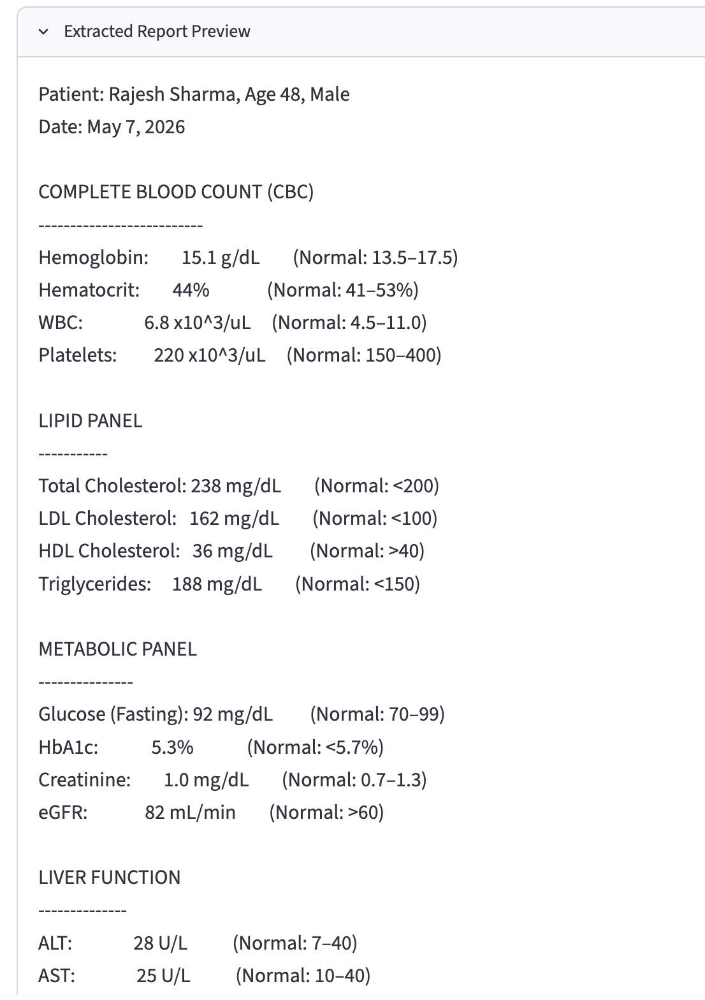
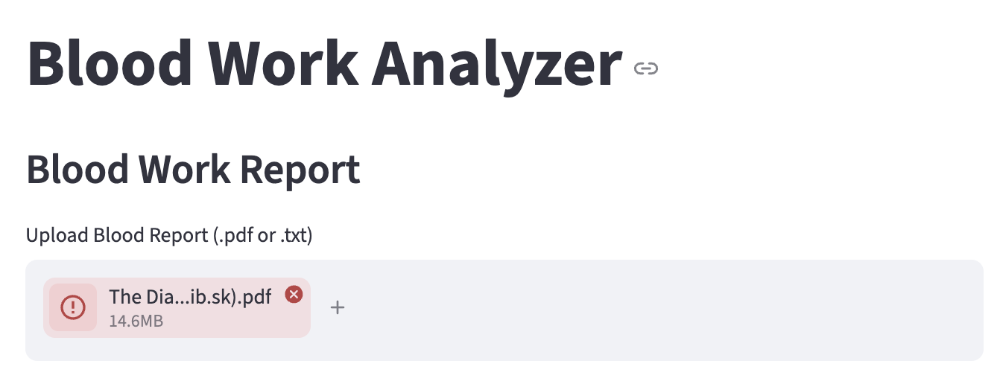
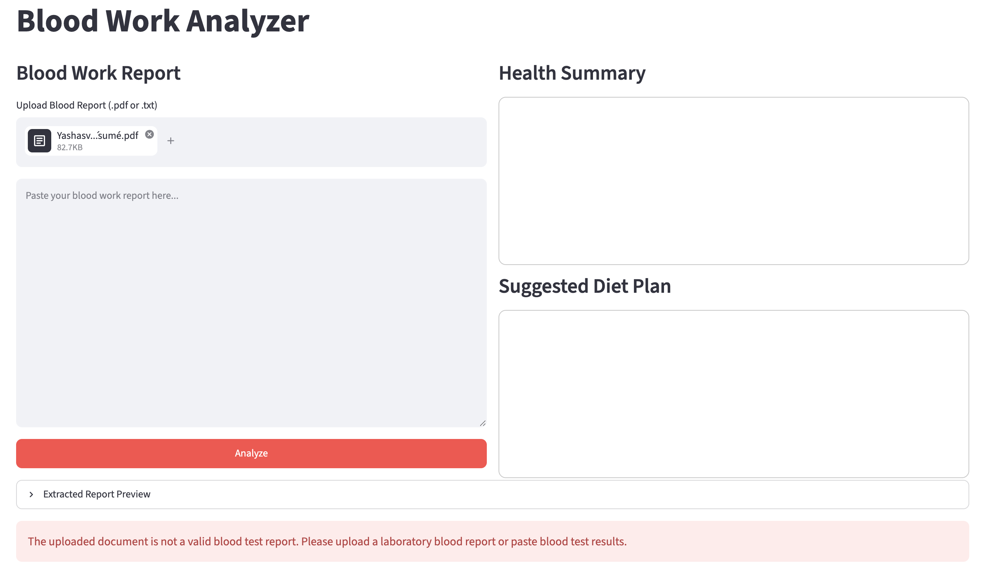

# AI Blood Report Analyzer

An AI-powered web application that analyzes blood test reports using Google's Gemini large language model (LLM). The application extracts laboratory values from blood reports, identifies abnormal parameters, generates an easy-to-understand health summary, and recommends personalized Indian diet suggestions.

## Live Demo

Application: [STREAMLIT_APP_URL](https://ai-blood-report-analyzer-kfexwrzpzzoc7dsjypseoq.streamlit.app/)
Repository: [GITHUB_REPOSITORY_URL](https://github.com/Yashasvi-Y/ai-blood-report-analyzer.git)

---

## Features

- Upload blood reports in PDF and TXT formats.
- Paste blood report text directly into the application.
- Automatic text extraction from PDF reports.
- Preview extracted report before analysis.
- Detection of invalid or non-medical documents.
- Extraction and classification of blood test parameters.
- AI-generated health summary in simple language.
- Personalized Indian diet recommendations.
- Report statistics showing Normal, High, and Low parameters.
- Download analysis as a PDF report.
- Responsive Streamlit interface with Light and Dark mode support.

---

## Tech Stack

| Category | Technologies |
|----------|--------------|
| Language | Python |
| Frontend | Streamlit |
| LLM | Google Gemini |
| Framework | LangChain |
| PDF Processing | pdfplumber |
| PDF Generation | ReportLab |
| Environment | python-dotenv |

---

## Project Structure

```text
ai-blood-report-analyzer/
│
├── app.py
├── pyproject.toml
├── uv.lock
├── README.md
├── blood_work.txt
├── .env.example
├── .gitignore
└── .streamlit/
    └── config.toml
```

---

## Application Workflow

```text
               PDF / TXT / Manual Input
                          │
                          ▼
              Extract Text from Document
                          │
                          ▼
            Blood Value Extraction (Gemini)
                          │
                          ▼
        Detection of High / Low / Normal Values
                          │
                          ▼
      Health Summary + Diet Recommendation
                          │
                          ▼
              Download Analysis Report (PDF)
```

---

## Screenshots

### Home Screen

<p align="center">
    
    
</p>

---

### Blood Report Analysis

<p align="center">
    
    
</p>

---

### Invalid Document Detection

<p align="center">
    
    
</p>

---

## Installation

Clone the repository:

```bash
git clone https://github.com/Yashasvi-Y/ai-blood-report-analyzer.git
cd ai-blood-report-analyzer
```

Install dependencies:

```bash
uv sync
```

---

## Environment Variables

Create a `.env` file in the project root.

```env
GOOGLE_API_KEY=YOUR_API_KEY
```

---

## Running the Application

```bash
uv run streamlit run app.py
```

---

## Future Improvements

- OCR support for scanned blood reports.
- Export reports with improved formatting and charts.
- Historical report comparison.
- Visualization of blood parameter trends.
- Support for additional laboratory report formats.

---

## Disclaimer

This application is intended for educational and demonstration purposes only. The generated analysis should not be considered a substitute for professional medical advice, diagnosis, or treatment.

---

## Author

Yashasvi Yadav
